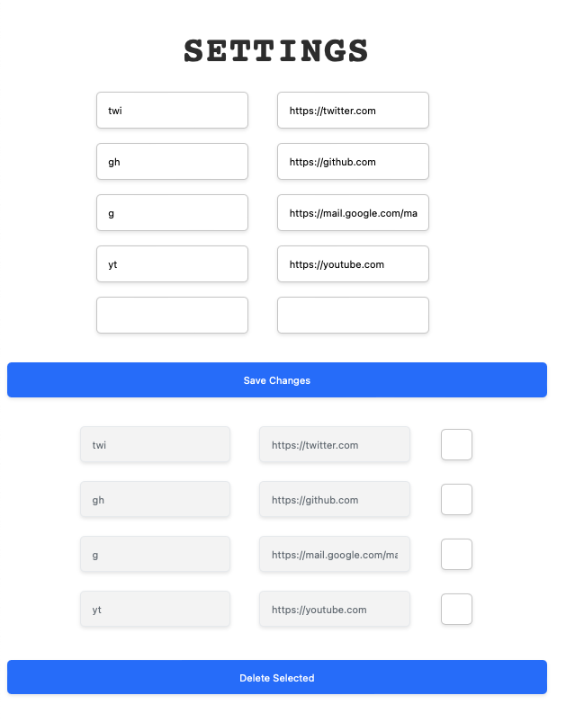

# `ves-a` a simple redirector

At work we can define short links of the form `http://go/somewhere`, which is extremely convenient. I missed having that, so I repurposed a Pi Pico W to hold the redirecting service. To be fair, it could run on my Mac or on a dedicated Pi (not pico) together with [`PiHole`](https://pi-hole.net), but this was more fun. Feel free to explore that, or write a similar redirector in your favourite language now that you know this works.

> [!IMPORTANT]
> _ves a_ is Catalan for _go to_. It sometimes goes together with _a la merda_ or _a cagar_.

## Configuring

> [!NOTE]
> If you want a Pico W, I always buy from Pimoroni. I don't get any commission or anything, I just like them 🏴‍☠️.

For the Pico W software side, just upload everything and add a file called `ssid.py` with a dictionary like:

```python
ssid = {"name": networkname, "password": password}
```

This is ignored and not uploaded to the repo 😉

---

The annoying part is setting up the redirection from `go` (or whatever you want) to the Pico server:

- You likely want to set a static IP for the Pico. This needs to be done on your router
- If your router lets you set static routes, set one from `go` (or whatever you want as a redirection) to your Pico's IP.
- Otherwise, the easiest route is using [`PiHole`](https://pi-hole.net) on some device (I set it on my Mac Mini, since it is always running) and using it as your DNS. Then, you can set a local DNS record from `go` to your Pico's IP.
    - This is better if you set the device that has PiHole with a fixed IP too.
    - And doubly so if you can set it as the DNS resolver for your router. I wasn't so lucky.
- If you are feeling adventurous, you could just set up `dnsmasq` on a device and configure the same routing. It's the same, wastes less resources, but _it is always DNS_ hits hard here.

Once everything works, with the redirects set up as examples here you can type `go/twi` in your browser to go to Twitter, or `go/yt` to go to YouTube.

## Using

You can add redirections manually to the `redirects.txt` file, the format is `shortname URL_WITH_PROTOCOL`, with one space between them. Shortname can start with or without `/`, both will work.

Once everything is running, you can configure it online too:



To delete a record, select it on the second list and press delete. You can only delete them one at a time, I was lazy when writing the checker. If you want to delete more, just edit the file, come on.

To add a record, add it to the first form, with or without a leading `/`. You can only add one at a time, same as above applies.

I should likely add a dark mode, yes, I know.

## Acknowledgements

- Placido for telling me he was running a redirection server in his home network. I didn't even think of that until then.
- Gemini for helping me (and also making me go extremely slow, too) write parts of this. Particularly useful to make the settings page look decent.